<!-- CAPA -->
<div align="center">

# Kapuã
## Guia do Usuário

**Gerador de números aleatórios com fonte física — portal, API e visualizações**

Dobslit · UFPE

</div>

---

## 2. Identificação da versão

| Item | Valor |
|---|---|
| Documento | Guia do Usuário do Kapuã |
| Versão do documento | 2026-08-29 (revisão técnica) |
| Portal | `https://bongo.dobslit.com` |
| Frontend documentado | imagem `qrng-web:9e36a90` |
| API documentada | imagem `qrng-client-api:4137bfe` |
| Branch da documentação | `docs/guia-usuario-kapua-20260829` (base `main` = `51c1a2d`) |
| API pública | OpenAPI 3.0.3 — "Kapuã QRNG — API Pública" v1.0.0 (`/qrng/v1/openapi.json`) |
| Serviço NIST | `qrng-nist-api` 1.1.0-staging-candidate, motor `sp800-90b-reference` (real) |
| Guia anterior | `docs/_acceptance/PRIOR_Guia_Usuario_Kuapoa_QRNG.docx` (SHA-256 `1cc904c9…dcfd07`) — preservado como referência; conteúdo incorreto **não** reaproveitado |

> Este guia descreve **o que está em produção hoje**. Correções ainda não implantadas aparecem como *recomendações* e são identificadas como tal.

---

## 3. Apresentação do Kapuã

O **Kapuã** é a infraestrutura da Dobslit/UFPE para distribuir **bytes aleatórios** obtidos de uma **fonte física** (uma placa Red Pitaya com FPGA que digitaliza um sinal de ruído). Os bytes atravessam uma cadeia de software auditada e são disponibilizados de três formas:

1. **Portal web** (`https://bongo.dobslit.com`) — páginas para explorar, visualizar, baixar e testar os dados.
2. **API HTTP** (`https://bongo.dobslit.com/qrng/v1`) — para consumo programático (curl, Python, Jupyter…), com **token pessoal**.
3. **Serviço NIST** — avaliação estatística de amostras pela suíte NIST SP 800-90B.

**O que o Kapuã entrega hoje, com evidência:** bytes; os formatos (`raw`/`hex`/`base64`/`uint8`) representam **os mesmos bytes**; o contrato de transporte é `uint32` little-endian quando 4 bytes são lidos como inteiro; o software auditado **preserva** os bytes a partir do broker (`server_api.py`) até a resposta HTTP, sem transformação de conteúdo nas fronteiras auditadas; as visualizações aplicam transformações matemáticas documentadas; o token dá acesso programático; a proveniência é informada em cada resposta.

**O que o Kapuã ainda NÃO afirma:** que há "8 bits garantidos de entropia por byte"; que os dados são "100% aleatórios", "sem viés", "certificados/validados pelo NIST", "IID comprovado permanentemente" ou "prontos para qualquer aplicação criptográfica"; que a origem quântica está "comprovada pelo histograma"; que a API "melhora" a entropia; que uma resposta é "live verificada" enquanto `live_verified=false`. A **caracterização física da fonte e a validação operacional continuam em andamento** (ver seções 22, 23, 24 e 29).

---

## 4. Escopo do guia

Este guia cobre: o portal e suas páginas; o cadastro, a autenticação e o token; a API (endpoints, parâmetros, formatos, erros, proveniência, limites); um exemplo completo em Jupyter; o que cada visualização faz com os dados; a página de testes NIST; os estados de saúde; e as limitações conhecidas.

**Sobre as figuras.** As capturas de tela deste guia foram feitas em **2026-08-29** a partir do **bundle de produção** (`qrng-web:9e36a90`, mesmo arquivo `assets/index-GEJGDRrN.js` servido em `https://bongo.dobslit.com`), renderizado localmente e consumindo os **endpoints QRNG reais da produção**. Nenhuma figura mostra token, senha, cookie ou cabeçalho de autenticação. Em todas, a barra superior exibe `origem efetiva: desconhecida` — a produção **não** classifica as respostas como *live* nesta fase (ver seções 22–23). Detalhes de proveniência das imagens em `docs/images/README.md`.

Este guia **não** cobre: a construção do hardware/FPGA; a bitstream/RTL; a operação interna do broker; procedimentos administrativos. Segurança e auditoria de credenciais estão fora do escopo. **Nenhum token, senha, cookie ou chave** aparece neste guia, nos exemplos ou nas figuras.

---

## 5. Visão geral do portal


O portal é uma aplicação de página única (React) servida por nginx em `https://bongo.dobslit.com`. A navegação principal tem estas seções:

| Seção (navegação) | O que faz |
|---|---|
| **Kapuã** | Página inicial: explica a cadeia de dados (FPGA → captura → buffer → aplicações), tem um widget que sorteia um número e um botão de download de 1 MiB. |
| **Representações Visuais** | Duas abas: **Visualizações Interativas** (Galáxia, Mandala, LCG Cracker, MT19937 Clone, Sonificação — PRNG × QRNG lado a lado) e **Análise Estatística** (Scatter, Histograma, Bits, badges de testes, Fluxo em tempo real). |
| **Dados** | Exportação: Raw Binário, Hexadecimal, Decimal/uint8, Faixa Personalizada, Monte Carlo (floats). Presets rápidos (loteria, dado, dataset…). |
| **Aplicações** | Sete demonstrações: Chave Quântica (desabilitada), Seed para IA (desabilitada), Monte Carlo π, Sorteio Auditável, Jogos (moeda/dado), Random Walk, Otimização Estocástica. |
| **Teste NIST** | Enfileirar e acompanhar avaliações SP 800-90B (upload de arquivo ou arquivo no servidor). |
| **Desenvolvedor** | Login/registro, gestão do **token pessoal**, playground "Notebook", uso/cota, histórico de chamadas, documentação. |
| **Configurações** | Escolha da fonte: **Remota (SP)**, **FPGA (Hardware)** ou **Pré-coletado** (buffer local de demonstração). |

**Barra de Hardware** (topo, sempre visível): estado on-line/off-line, badge de **proveniência** (nunca mostra "live" sem evidência), e — quando disponível — bytes no buffer, gerados e consumidos.

**Banner de fallback** (global): aparece em todas as telas quando a fonte **Pré-coletado** está selecionada, informando quantos bytes restam, que a proveniência não está registrada e que a geração de chave/seed está bloqueada nessa fonte.

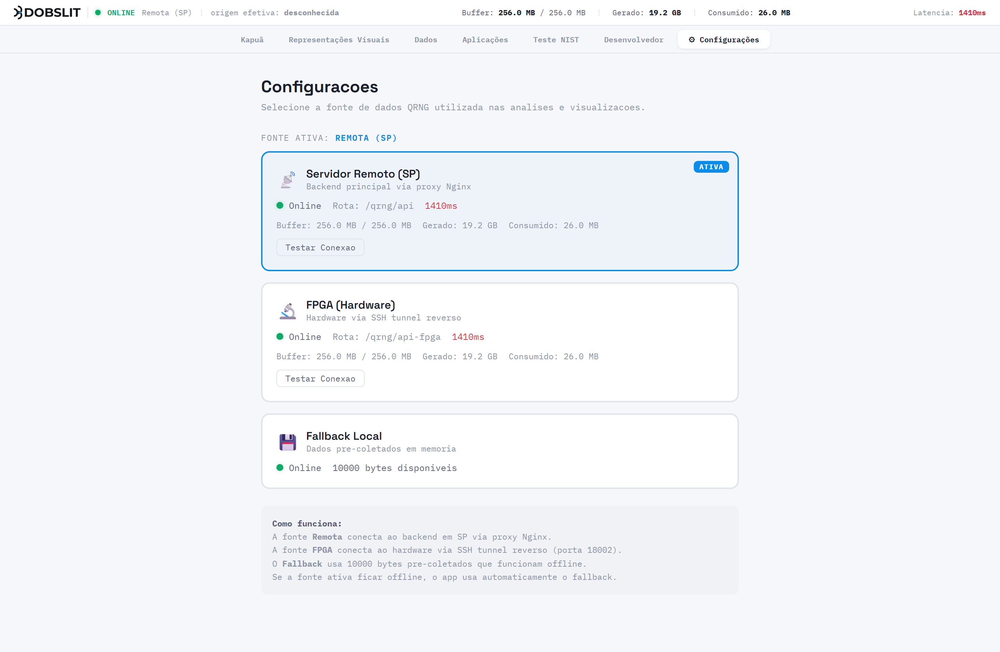


---

## 6. Cadastro e autenticação

1. Abra o portal e vá em **Desenvolvedor**.
2. **Registrar**: informe e-mail e senha → `POST /v1/auth/register` cria a conta e devolve um **JWT de sessão** (guardado no navegador).
3. **Entrar**: e-mail e senha → `POST /v1/auth/login` devolve o JWT de sessão.
4. `GET /v1/auth/me` retorna os dados da conta autenticada.

O JWT de sessão autentica **a interface** (gestão de token, playground, uso). Ele **não** é o token que você usa fora do portal — esse é o **token pessoal** (seção 7).

> Nunca compartilhe sua senha nem seu JWT. O portal armazena o JWT apenas no seu navegador.

---

## 7. Criação e gerenciamento de token

O **token pessoal de API** é a credencial para consumir a API de fora do portal (curl, Python, Jupyter, serviços).

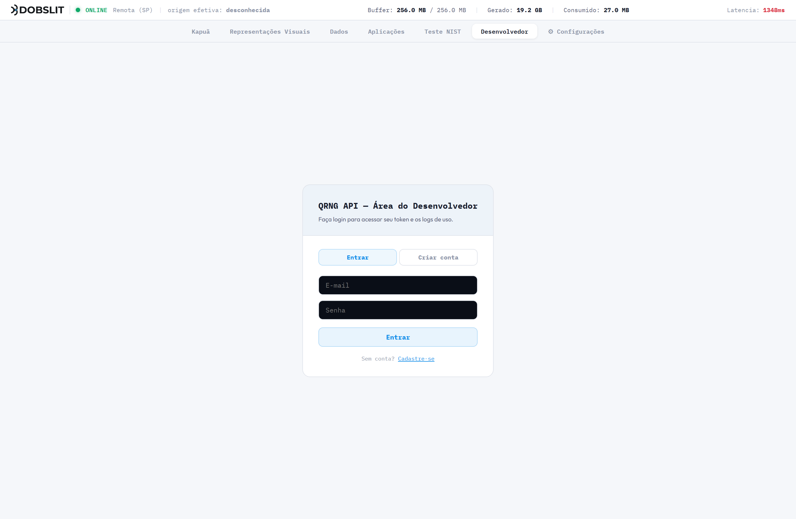

| Ação | Endpoint | Observação |
|---|---|---|
| Emitir | `POST /v1/tokens` | **Um token por usuário.** O valor completo é mostrado **uma única vez** (na criação/rotação). Formato: `dobslit_qrng_live_<hex>`. |
| Ver metadados | `GET /v1/me/token` | Nunca devolve o valor completo — só prefixo, data, cota, uso. |
| Rotacionar | `POST /v1/me/token/rotate` | Revoga o atual e emite um novo (mesma cota/nome). |
| Revogar | `POST /v1/me/token/revoke` | Revoga sem emitir outro. |
| Uso e cota | `GET /v1/me/usage` | Cota diária, uso hoje/7d/30d, histórico diário. A cota **reseta à meia-noite UTC**. |
| Histórico de chamadas | `GET /v1/me/requests?limit=N` | Últimas chamadas feitas com o token. |

**No portal:** aba **Desenvolvedor → Token** — botões *Gerar*, *Regenerar*, *Revogar*, e o cartão de uso/cota (com aviso a partir de 80%).

**Boas práticas de segurança do token**
- O token **não expira**, mas pode ser rotacionado/revogado a qualquer momento.
- **Nunca** escreva o token em código versionado, em logs, em prints ou em issues. Use uma variável de ambiente (`KAPUA_API_TOKEN`).
- Se suspeitar de vazamento, **rotacione** imediatamente.
- Se precisar exibir "qual token está em uso", mostre só o **prefixo** (`dobslit_qrng_live_…`).

**O que o token faz e o que não faz**
- **Faz:** autentica o acesso; contabiliza a cota; habilita o limite maior por requisição (1 MiB) e os endpoints `/v1/health` e `/v1/me/*`.
- **Não faz:** não altera, não condiciona, não "melhora" e não filtra os bytes aleatórios. Os bytes retornados são exatamente os que o broker entregou. Com ou sem token, a fonte é a mesma.

---

## 8. Uso da API

**Base:** `https://bongo.dobslit.com/qrng/v1`
**Autenticação:** header `Authorization: Bearer <API_TOKEN>` (token pessoal). Alguns endpoints de consumo também aceitam o JWT de sessão; `/v1/me/*` aceita ambos.
**Documentação interativa:** Swagger em `/qrng/v1/docs/`, ReDoc em `/qrng/v1/redoc`, OpenAPI JSON em `/qrng/v1/openapi.json`.


### 8.1 Endpoints

| Método | Caminho | Auth | Descrição |
|---|---|---|---|
| GET | `/v1/random?bytes=N&format=hex\|base64\|uint8\|raw` | token | Gera N bytes. `format` omitido = `hex`. |
| GET | `/v1/raw?bytes=N` | token | Alias de `…/random?format=raw` — `application/octet-stream` com N bytes exatos. |
| GET | `/v1/public/random?bytes=N&format=…` | nenhuma | Igual, anônimo, cota reduzida. |
| GET | `/v1/public/raw?bytes=N` | nenhuma | Raw anônimo. |
| GET | `/v1/health` | token | Saúde do client-api + do upstream (buffer, `source_status`, `stream_format`, `sample_width_bytes`, `conditioned`). |
| GET | `/v1/health/self` | nenhuma | Liveness do processo Node (não consulta o upstream). |
| POST | `/v1/auth/register`, `/v1/auth/login` · GET `/v1/auth/me` | — / JWT | Conta e sessão. |
| POST | `/v1/tokens` · GET `/v1/me/token` · POST `/v1/me/token/rotate\|revoke` | JWT/token | Gestão do token. |
| GET | `/v1/me/usage`, `/v1/me/requests` | JWT/token | Uso e histórico. |
| GET | `/v1/upstream/status` | token | Histórico de disponibilidade do upstream (últimas 500 transições, uptime 24 h). |
| GET | `/v1/metrics` | — | Métricas Prometheus. |
| POST/GET | `/v1/bulk-random-jobs[...]` | token | **Não implementado** — stub que responde 501. |

### 8.2 Parâmetros de `/random`

| Parâmetro | Tipo | Default | Regras |
|---|---|---|---|
| `bytes` | inteiro ≥ 1 | 32 | ≤ **1 048 576** com token; ≤ **65 536** no público. Acima → `413`. Não-inteiro/≤0 → `422`. |
| `format` | `hex` \| `base64` \| `uint8` \| `raw` | `hex` | Outro valor → `422`. |

### 8.3 Corpo da resposta

**`format=hex\|base64\|uint8` (ou omitido)** → `application/json`:

```json
{
  "request_id": "req_…",
  "source": "dobslit-qrng-ufpe-fpga",
  "provenance": "unknown",
  "provenance_detail": {
    "configured_source": "fpga",
    "instance_mode": "live",
    "actual_origin": "unknown",
    "transport_health": "healthy",
    "buffer_health": "discontinuous",
    "entropy_health": "not_assessed",
    "captured_at": null,
    "served_at": "2026-08-29T14:41:21.009Z",
    "sample_age_ms": 120,
    "capture_id": "cap_…",
    "fallback_used": false,
    "live_verified": false,
    "provenance_version": "1",
    "sequence": 10768,
    "capture_sha256": "…"
  },
  "bytes": 8,
  "format": "hex",
  "random": "3f0f2ab4bd82d289",
  "timestamp": "2026-08-29T14:41:21.009Z"
}
```

- `random`: **hex** = string de `2·bytes` caracteres `[0-9a-f]`; **base64** = string base64 padrão; **uint8** = array de `bytes` inteiros em `[0,255]`.

**`format=raw`** → `application/octet-stream`, **exatamente N bytes**, `Content-Length = N`, **sem JSON, sem prefixo, sem BOM**. A proveniência vai em **headers**: `X-QRNG-Provenance`, `X-QRNG-Live-Verified`, `X-QRNG-Fallback-Used`, `X-QRNG-Transport-Health`, `X-QRNG-Buffer-Health`, `X-QRNG-Entropy-Health`, `X-QRNG-Served-At`, `X-QRNG-Received-At`, `X-QRNG-Capture-Id`, `X-QRNG-Sample-Age-Ms`, `X-QRNG-Discontinuities`, `X-QRNG-Conditioned`, `X-Request-Id`.

### 8.4 Exemplos curtos (curl)

```bash
# hex (JSON)
curl "https://bongo.dobslit.com/qrng/v1/random?bytes=32&format=hex" \
  -H "Authorization: Bearer $KAPUA_API_TOKEN"

# binário puro para um arquivo
curl "https://bongo.dobslit.com/qrng/v1/random?bytes=1024&format=raw" \
  -H "Authorization: Bearer $KAPUA_API_TOKEN" -o amostra.bin

# sem token (público, cota reduzida)
curl "https://bongo.dobslit.com/qrng/v1/public/random?bytes=16&format=base64"
```

---

## 9. Exemplo completo em Jupyter

O notebook **`docs/examples/kapua_jupyter_example.ipynb`** (Python, só biblioteca padrão) cobre, contra o contrato **real** da produção:

1. `GET /v1/health` (com token) e `/v1/health/self` (sem token);
2. `GET /v1/random?format=raw` → salvar `.bin`, SHA-256, request_id, proveniência;
3. `format=hex` → decodificar; 4. `format=base64` → decodificar; 5. `format=uint8` → validar `0..255` e quantidade;
6. **equivalência dos 4 formatos sobre uma amostra única** (não 4 chamadas): `raw == decode(hex) == decode(base64) == bytes(uint8)`, SHA-256 idêntico;
7. contrato binário e `uint32-LE` (`x = b₀ + b₁·2⁸ + b₂·2¹⁶ + b₃·2²⁴`; `u = x/2³² ∈ [0,1)`); tamanho não múltiplo de 4;
8. inteiro uniforme sem modulo bias (rejection sampling sobre uint32);
9. ler request ID e proveniência; `GET /v1/me/usage`;
10. tratar 401 (`MISSING_TOKEN`), 403 (`INVALID_TOKEN`), 429 e 503 (backoff exponencial), timeout — **sem** imprimir o token.

Trecho essencial (autenticação):

```python
import os, urllib.request, urllib.parse, json
API_TOKEN = os.environ["KAPUA_API_TOKEN"]           # nunca escreva o token no código
headers = {"Authorization": f"Bearer {API_TOKEN}"}

url = "https://bongo.dobslit.com/qrng/v1/random?" + urllib.parse.urlencode(
    {"bytes": 64, "format": "hex"})
req = urllib.request.Request(url, headers=headers)
body = json.loads(urllib.request.urlopen(req, timeout=30).read())
data = bytes.fromhex(body["random"])               # 2 chars por byte
assert len(data) == body["bytes"] == 64
print(body["request_id"], body["provenance"], body["provenance_detail"]["live_verified"])
```

> O notebook roda **sem token** caindo para `/v1/public/random` (demonstrado — ver `docs/_acceptance/notebook_cells_run.txt`). Com `KAPUA_API_TOKEN` no ambiente, usa o caminho autenticado.
> **O token autentica o acesso e mede a cota — não altera, não condiciona nem melhora os dados aleatórios.**

Há também um script equivalente: **`docs/examples/kapua_api_example.py`**.

Para uma **bateria de análises estatísticas e de uso** sobre bytes reais (χ², monobit, runs, DFT, autocorrelação, KS, compressão, bitmap; e usos: uniforme `u=x/2³²`, Monte Carlo π, dado justo, passeio 2D, colisões de aniversário, semente/KDF), veja **`docs/examples/kapua_qrng_analises.ipynb`** — já vem executado, com gráficos e a tabela‑resumo. Ele também lê `KAPUA_API_TOKEN` do ambiente. Observação honesta: nessa fonte o teste **monobit** costuma acusar um viés de 1º momento pequeno porém mensurável (proporção de 1s ≈ 0,499) — coerente com a caracterização em andamento (seção 29).

---

## 10. Formatos Raw, Hex, Base64 e uint8

Os quatro formatos são **quatro representações dos mesmos bytes**. Para uma amostra de N bytes:

| Formato | Tipo de resposta | Conteúdo | Decodificação no cliente |
|---|---|---|---|
| `raw` | `application/octet-stream` | os N bytes, nada mais | usar os bytes direto |
| `hex` | JSON, campo `random` | `2N` caracteres `[0-9a-f]` | `bytes.fromhex(s)` / `parseInt(s.substr(i*2,2),16)` |
| `base64` | JSON, campo `random` | base64 padrão | `base64.b64decode(s)` / `atob` |
| `uint8` | JSON, campo `random` | array de N inteiros `[0,255]` | `bytes(arr)` / `Uint8Array.from(arr)` |

**Verificado** (`docs/_acceptance/format_equivalence_check.mjs`, 14/14; notebook célula 6):

```
raw == decode(hex)
raw == decode(base64)
raw == bytes(uint8)
SHA-256 idêntico em todos os formatos
N bytes solicitados == N bytes entregues
sem BOM · sem bytes extras · hex é [0-9a-f] com 2 chars/byte · uint8 em 0..255
```

**Importante:** duas **chamadas independentes** à fonte retornam sequências **diferentes** (é o esperado). Nunca prove a equivalência dos formatos comparando quatro chamadas live — use **uma amostra capturada uma única vez** e reserialize/decodifique localmente.

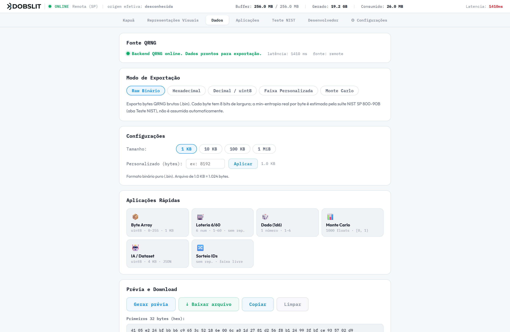

---

## 11. Contrato binário e endianness

| Conceito | Valor |
|---|---|
| `TRANSPORT UNIT` | **byte** |
| `TRANSPORT WORD` | **uint32 little-endian**, quando 4 bytes são lidos como inteiro |
| `SOURCE PHYSICAL SAMPLE` | **desconhecida** (não confirmada — ver seção 23) |
| `CONDITIONING` (na FPGA) | **não confirmado / desconhecido** |
| `API CONDITIONING` | **ausente** (o software repassa os bytes verbatim; header `X-QRNG-Conditioned: false`) |

**Leitura de uint32 (little-endian):**
`x = b₀ + 2⁸·b₁ + 2¹⁶·b₂ + 2²⁴·b₃`

Isto equivale a `DataView.getUint32(i, true)` em JavaScript e a `struct.unpack("<I", …)` em Python. **Não** use big-endian: para os bytes `00 01 02 03`, LE dá `50462976` e BE dá `16909060` — números diferentes. O frontend usa `readUint32LE` (com `>>> 0`, portanto **sem sinal**) de forma consistente em todos os lugares.

**Normalização para `[0, 1)`:** `u = x / 2³²`. Máximo possível `0xFFFFFFFF / 2³² = 0.99999999976… < 1`. Nunca se divide por `2³²−1`; nunca se produz `≥ 1`.

**Bytes que não completam 4:** ao converter um buffer em array de uint32, os 1–3 bytes finais que não formam uma palavra completa são **descartados** (`i + 3 < comprimento`). A mesma regra vale em toda a base.

**Quantização discreta (só na Análise Estatística):** a página *Análise Estatística* normaliza cada byte por `b / 255` → 256 níveis discretos em `[0, 1]` **inclusive** (o valor `1.0` é alcançável, por `b = 255`). É intencional e testado. **Não confunda** com o Monte Carlo (`uint32 / 2³²`, contínuo em `[0, 1)`).

---

## 12. Downloads e exportações

| Origem | Rota | Formato do arquivo | Tamanho |
|---|---|---|---|
| **Dados → Raw Binário** | `…/random?format=raw` | `.bin` (`application/octet-stream`, N bytes exatos) | 1 B – 1 MiB |
| **Dados → Hexadecimal** | `…/random?format=hex` | `.txt` ou `.json` (separadores configuráveis) | 1 B – 1 MiB |
| **Dados → Decimal/uint8** | `…/random?format=hex` | `.csv` / `.txt` / `.json` (inteiros 0–255) | 1 B – 1 MiB |
| **Dados → Faixa Personalizada** | `…/random?format=hex` | `.json` / `.csv` / `.txt` (inteiros em `[min,max]`) | até 100 000 números |
| **Dados → Monte Carlo** | `…/random?format=hex` | `.csv` (15 casas) / `.json` (floats `[0,1)`) | até 100 000 pontos |
| **Downloads em massa** (`DataExport`) | `…/random?format=raw` | `.bin` | 1 KB – 50 MB |
| **Kapuã → download 1 MiB** | `…/random?bytes=1048576&format=hex` | `.bin` (hex decodificado no cliente) | 1 MiB |


![Figura 10 — Aba "Dados", modo "Faixa Personalizada": inteiros em `[min, max]` com/sem repetição, por rejection sampling (sem viés de módulo) ou algoritmo de Floyd F2.](images/07-dados-faixa.png)


Observações:
- Os nomes de arquivo gerados pela aba **Dados** hoje usam o prefixo `kuapua_qrng_*` (grafia antiga). **Recomendação (não implantada):** padronizar para `kapua_qrng_*`. Ver seção 29.
- O download da **Kapuã** usa `format=hex` e decodifica no navegador; os **bytes são idênticos** ao `format=raw`, apenas o transporte difere.
- Na fonte **Pré-coletado**, o download é limitado ao que resta do buffer local (10 000 bytes, sem repetição na sessão); acima disso a UI mostra um erro explícito, sem cair silenciosamente para outra fonte.
- A tela dos downloads afirma explicitamente: *"uint32-LE, sem conditioning; a min-entropia estimada da fonte ainda está em validação — não use como material criptográfico operacional sem consultar a documentação técnica"*.

---

## 13. Visualizações — visão geral

Todas as visualizações consomem **os mesmos bytes** da fonte selecionada e aplicam transformações **matemáticas determinísticas documentadas** (fórmulas na seção correspondente e em `docs/VISUALIZATION_DATA_FLOW.md`). Nenhuma visualização "melhora" os dados; elas **apresentam** os dados.

- Fonte dos bytes: as páginas centrais usam as rotas de proxy (`/qrng/api…`); as *Visualizações Interativas* usam a rota autenticada (`/qrng/v1/random`, com o JWT de sessão do portal).
- Fallback: quando a rede falha ou o buffer pré-coletado esgota, as *Visualizações Interativas* passam a usar `Math.random()` e **rotulam isso** ("QRNG · Math.random() — erro de rede / pré-coletado esgotado"). **Nenhum uso de `Math.random()` é apresentado como QRNG** (ver a classificação completa em `docs/VISUALIZATION_DATA_FLOW.md`).
- Byte de valor `0` é entropia legítima e **nunca** é trocado por PRNG.

As seções 14–21 detalham cada visualização.

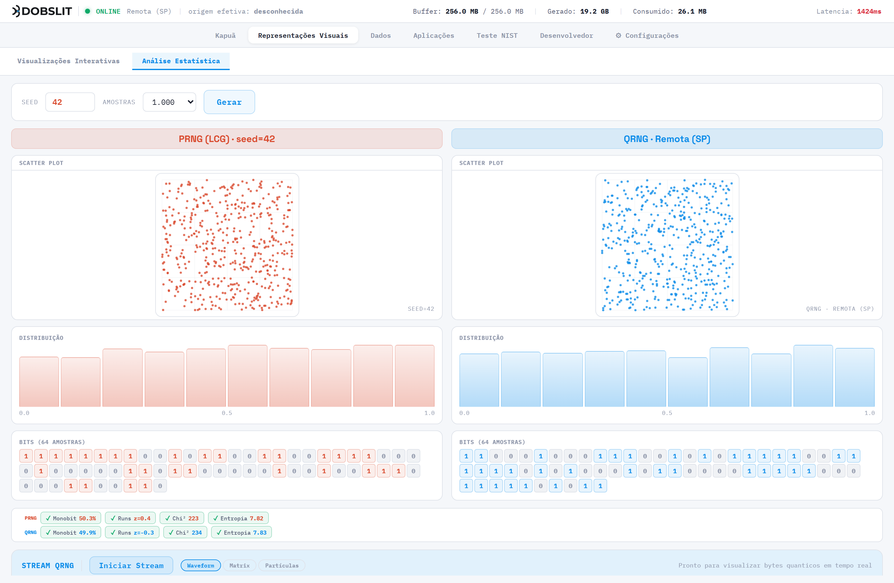


---

## 14. Histograma

- **Onde:** Representações Visuais → Análise Estatística (colunas PRNG e QRNG).
- **Entrada:** `count` bytes (200–10 000), normalizados por `b/255` → `[0, 1]`.
- **Transformação:** 10 bins iguais. Para cada valor `v`: `idx = min(⌊v·10⌋, 9)`; incrementa `buckets[idx]`. A altura de cada barra é `count/max·100%`.
- **Eixo:** rótulos `0.0`, `0.5`, `1.0`. O tooltip mostra a faixa do bin e a contagem.
- **Interpretação:** barras aproximadamente iguais sugerem distribuição uniforme **na amostra exibida**. Isso **não** é prova de aleatoriedade nem de "origem quântica"; é uma inspeção visual de 1ª ordem.
- **Limitação:** `v = 1.0` (byte 255) cai no último bin; 10 bins é grosseiro; a amostra é pequena.

---

## 15. Scatter (dispersão)

- **Onde:** Análise Estatística.
- **Entrada:** `count` bytes → `b/255`; pares consecutivos `(v[2k], v[2k+1])`.
- **Transformação:** ponto no plano `[0,1]²`, `x = v[2k]`, `y = v[2k+1]` (2 bytes por ponto).
- **Interpretação:** para o QRNG, a nuvem deve parecer "sem estrutura"; para um PRNG fraco (LCG), aparecem retas/planos (hiperplanos de Marsaglia). É uma **demonstração comparativa**, não um teste.
- **Limitação:** 256 níveis discretos; sem eixos numéricos além do quadro.

---

## 16. Visualização de bits

- **Onde:** Análise Estatística ("Bits (64 amostras)").
- **Entrada:** os mesmos valores `[0,1]` (PRNG e QRNG).
- **Transformação:** para os primeiros 64 valores, `bit = v > 0.5 ? 1 : 0`. Renderiza 64 células 0/1.
- **Interpretação:** um mosaico "sem padrão" é o esperado. O limiar fixo em `0.5` faz disto um teste de **paridade grosseira**, não uma extração de bits.
- **Limitação:** só 64 amostras; 1 bit por amostra.

### Badges de testes estatísticos (Monobit, Runs, Chi², Entropia)

Ao lado das colunas há quatro *badges* calculados **no navegador** sobre ~2000 bytes acumulados:

| Badge | Cálculo | "Passou" se | O que **não** é |
|---|---|---|---|
| Monobit | proporção de bits 1 | `|ratio − 0.5| < 0.03` | não é o Frequency Test completo do SP 800-22 |
| Runs | z-score do nº de corridas | `|z| < 2.58` | idem |
| Chi² | `Σ (obs−esp)²/esp` sobre 256 valores | `χ² < 310` | sem tabela exata |
| Entropia | Shannon `−Σ p·log₂p` por byte | `> 7.5` bits | **não é min-entropia**; não é SP 800-90B |

Esses badges dão um **sinal rápido lado a lado**. **Não** produzem crédito de entropia nem conformidade. Para avaliação séria, use a página **Teste NIST** (seção 24).

---

## 17. Monte Carlo (aba Dados)

- **Onde:** Dados → modo "Monte Carlo".
- **Entrada:** `count·4 + 16` bytes; lidos como uint32-LE.
- **Transformação:** para cada uint32 `n`: `push(n / 2³²)`. Consome **4 bytes por float**.
- **Saída:** `count` floats em `[0, 1)` (nunca `≥ 1`); download `.csv` (15 casas) ou `.json`.
- **Uso:** simulações que precisam de uniformes contínuos.
- **Diferença para a Análise Estatística:** aqui é `uint32/2³²` (resolução ≈ 2,33·10⁻¹⁰); lá é `byte/255` (256 níveis).

---

## 18. Cálculo de π (aba Aplicações)

- **Onde:** Aplicações → "π Monte Carlo Quântico". Opções: 1 000 / 10 000 / 100 000 pontos.
- **Entrada:** `nPoints·8` bytes → `2·nPoints` uint32-LE.
- **Transformação (verificada no código):**
  - `x_i = uint32ToFloat(u32[2i]) = u32[2i] / 2³²`
  - `y_i = uint32ToFloat(u32[2i+1]) = u32[2i+1] / 2³²`
  - `inside = Σ_i [ x_i² + y_i² ≤ 1 ]`
  - `π̂ = 4 · inside / nPoints`
  - `erro% = |π̂ − π| / π · 100`
- **Bytes por ponto:** 8 (dois uint32). `x, y ∈ [0, 1)` — nunca `= 1`.
- **Consistência:** o desenho no canvas, o contador `inside / total` e o valor `π̂` vêm **do mesmo laço** — não há divergência entre a tela e o número.
- **Nota de robustez:** se o buffer viesse curto, `u32[k]` seria `undefined` e o código usa `?? 0` (o ponto vira `(0,0)`, contado como "dentro"). Com `bytes = nPoints·8` isso não ocorre na prática.


---

## 19. Distribuição exponencial

**Status atual:** a função existe na biblioteca (`src/lib/qrngHelper.js`, `exponentialFromUniform`) e tem teste de regressão, mas **não há uma tela dedicada "Distribuição Exponencial"** na interface de produção. Esta seção documenta a função para quem a usar via API/código.

- **Fórmula (verificada no código):** `X = −μ · ln(1 − u)` (método da transformada inversa).
- **Parâmetro:** `μ` é a **média** da distribuição (não a taxa `λ`). Equivalente: `X = −ln(1−u)/λ` com `λ = 1/μ`.
- **Entrada `u`:** vem de `uint32/2³²`, logo `0 ≤ u ≤ 0.99999999976 < 1` → `ln(1−u)` é **sempre finito** (nunca `log(0)`).
- **`u = 0`:** `X = 0` (resultado válido).
- **Correspondência gráfico × download:** não aplicável hoje (sem tela). Se uma visualização for adicionada, ela deve usar exatamente esta fórmula e este parâmetro.

---

## 20. Comparação PRNG × QRNG

- **Onde:** Representações Visuais → Visualizações Interativas (Galáxia, Mandala, LCG Cracker, MT19937 Clone, Sonificação), com dois canvases lado a lado.
- **Lado QRNG:** bytes de `/qrng/v1/random` (8192 por recarga). Fallback rotulado para `Math.random()` em caso de erro de rede / buffer esgotado.
- **Lado PRNG:** um **LCG** interno — `s' = (s · 1103515245 + 12345) mod 2³²`, `value = (s' >>> 16)/65536 ∈ [0,1)` — **quantizado a 8 níveis** nas visualizações para tornar visível a estrutura do gerador linear.
- **LCG Cracker / MT19937 Clone:** demonstrações **didáticas** que recuperam os parâmetros de um LCG (ou clonam o estado de um Mersenne Twister após 624 saídas) — mostram a **previsibilidade do PRNG**, não uma propriedade do QRNG.
- **Classificação:** todo uso de PRNG aqui é **intencional, para comparação**, e está identificado como tal. Nenhum é apresentado como QRNG.

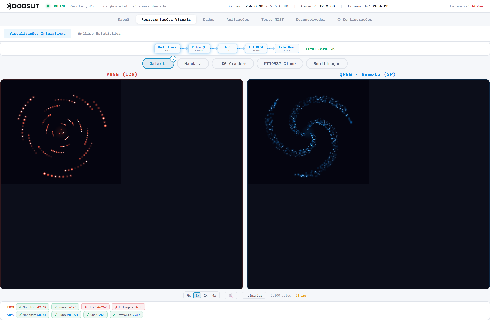

---

## 21. Galaxy spiral, Mandala e Sonificação

Disponíveis nas **Visualizações Interativas**.

| Visualização | Bytes → parâmetros (verificado) | Observação |
|---|---|---|
| **Galáxia** | por estrela (2 bytes): `raio = (b1/255)·0.88 + 0.05`; `spread angular = ((b2/255) − 0.5)·0.6`; `brilho = 0.3 + (b2/255)·0.7`; `tamanho = 1 + (b1/255)·2` | a distribuição final é uma espiral **por construção** — não é uniforme, e não deve ser lida como teste estatístico |
| **Mandala** | por ponto (2 bytes): `ângulo setorial = (b/255)·(2π/simetria)`; `raio = b/255` | idem — padrão radial por design |
| **Sonificação** | byte → nota musical (mapeamento de escala); evento `{type:"note", byte}` → `playNote(byte)` | o **ruído de percussão** do sintetizador usa `Math.random()` para gerar a amostra de áudio — isso **não** representa dados, é timbre |

Nas três, `Math.random()` só é usado se o array de bytes estiver **vazio**; o valor `0` é preservado.

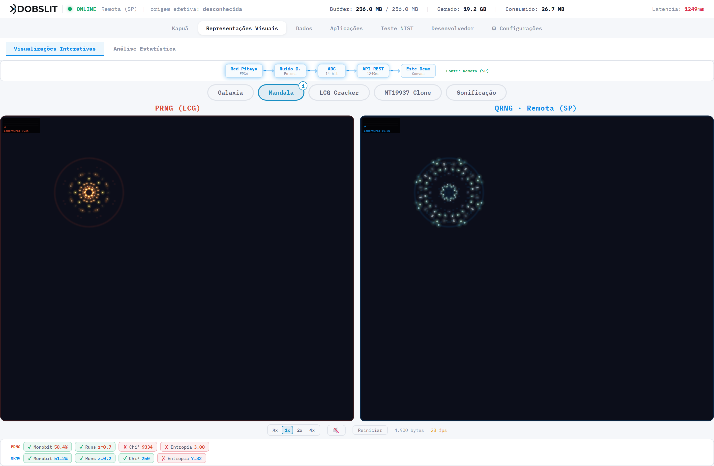

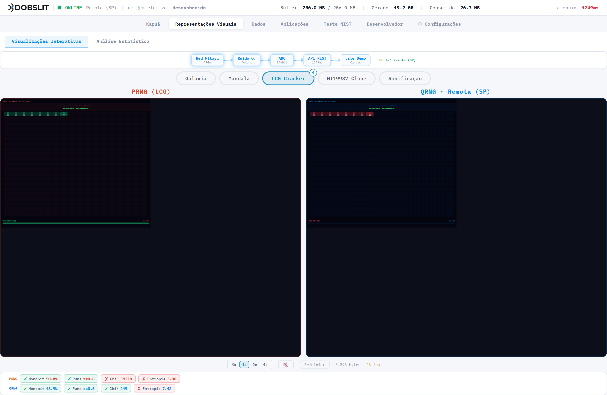

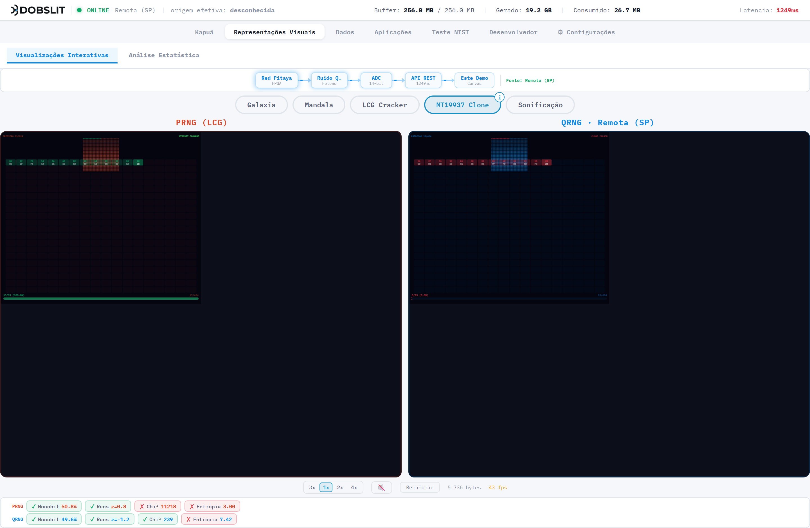

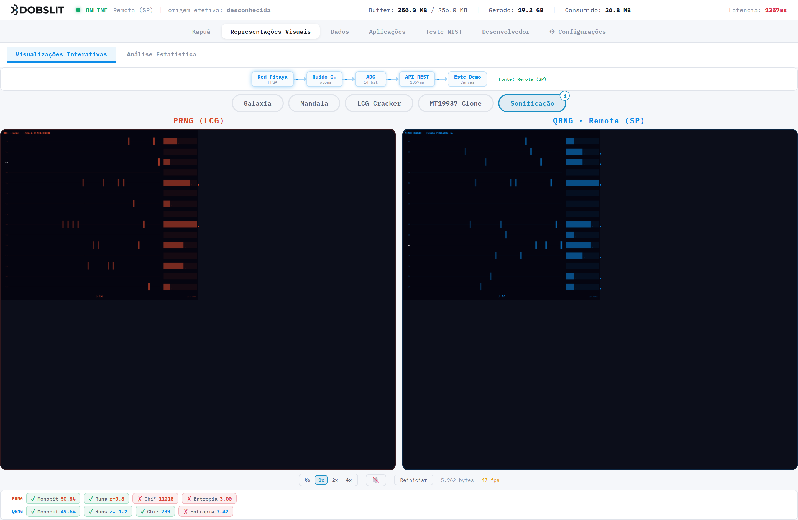

**Outras aplicações da aba "Aplicações"** (todas consomem bytes QRNG e usam rejection sampling onde há inteiros):

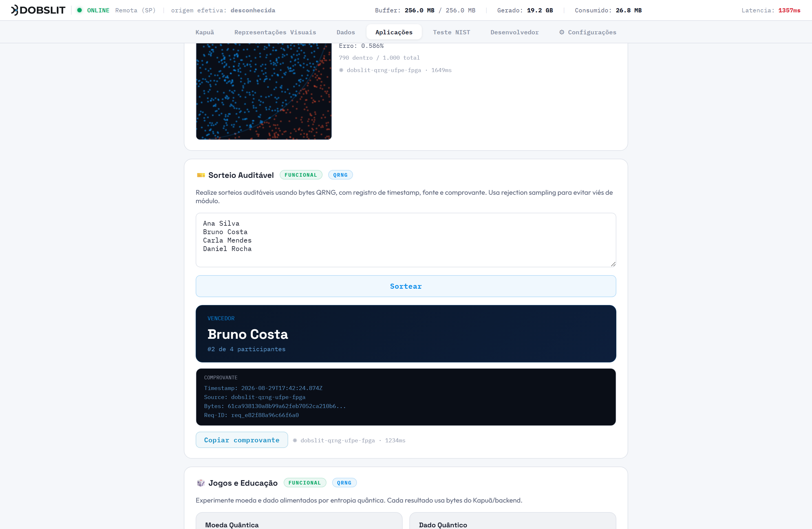

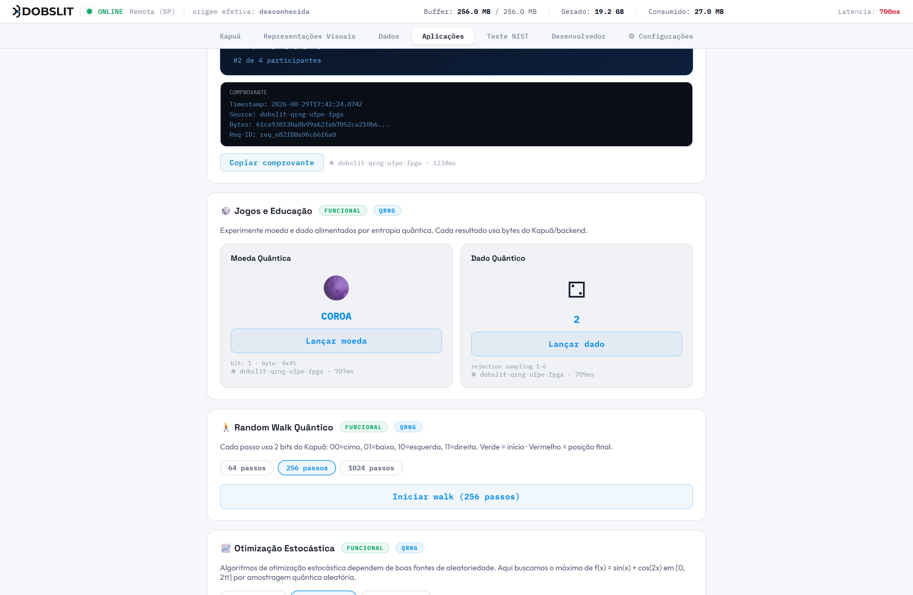

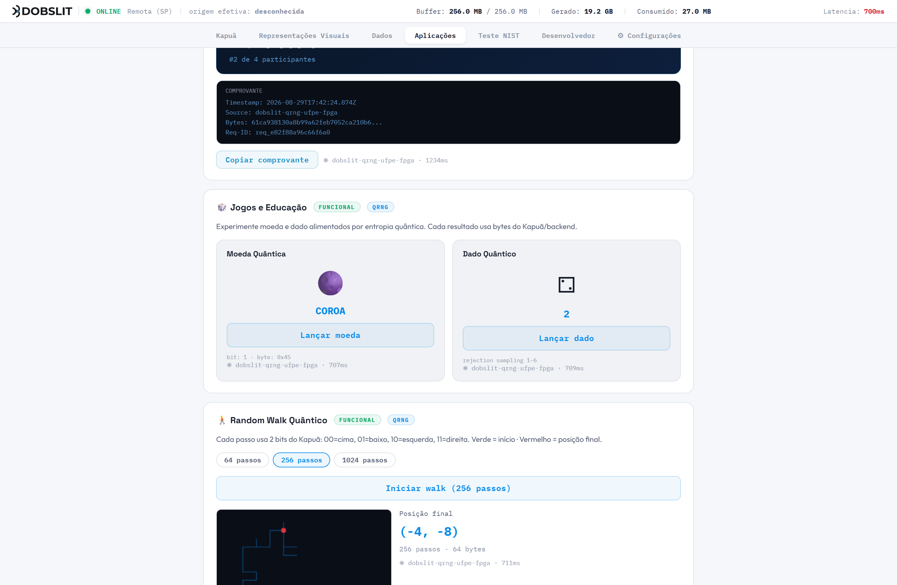

![Figura 23 — "Otimização Estocástica": busca do máximo de f(x) = sin(x) + cos(2x) em [0, 2π] por amostragem `uint32 ÷ 2³² · 2π`.](images/20-app-otimizacao.png)

---

## 22. Proveniência

Cada resposta traz uma **proveniência por resposta** (não uma etiqueta fixa da instância):

| Campo | Significado |
|---|---|
| `provenance` / `X-QRNG-Provenance` | origem **efetiva** desta resposta: `live`, `replay`, `fixture`, `historical`, `fallback` ou `unknown` |
| `provenance_detail.instance_mode` | capacidade/modo da instância (teto — nunca eleva uma resposta acima do que pode provar) |
| `provenance_detail.actual_origin` | igual a `provenance` |
| `live_verified` / `X-QRNG-Live-Verified` | `true` **somente** quando há evidência de captura física (`captured_at`) confirmando o caminho live nesta resposta |
| `captured_at` / `X-QRNG-Captured-At` | carimbo **físico** da FPGA (hoje **sempre `null`** — pendente do RTL) |
| `received_at` / `X-QRNG-Received-At` | instante em que o **broker** recebeu os bytes (fronteira de frescor verificável hoje) |
| `served_at` / `X-QRNG-Served-At` | instante em que a API respondeu |
| `sample_age_ms` | idade da amostra por `captured_at` (ou `received_at`, na ausência) |
| `capture_id`, `sequence`, `capture_sha256` | identificação e integridade do bloco (envelope v1) |
| `fallback_used` | se `true`, `actual_origin` é sempre `fallback` |

**Regras invioláveis (implementadas em `qrng-client-api/lib/provenance.js`):**
- `actual_origin = "live"` **só** com evidência do caminho live nesta resposta.
- `fallback_used = true` ⇒ `actual_origin = "fallback"` (prevalece sobre a configuração).
- Uma instância `replay`/`fixture`/`historical` **nunca** reporta `live`.
- Amostra antiga (`sample_age_ms > máximo`) não continua `live`.
- **`unknown` nunca é representado como `live`** — no frontend (`HardwareStatusBar`), nos exemplos e na API.

---

## 23. Live, fallback, histórico e unknown

| Estado | Quando aparece | O que significa para você |
|---|---|---|
| **`unknown`** | **estado atual da produção** | O caminho até a fonte física não pôde ser comprovado nesta resposta. Os bytes vieram do broker, mas sem carimbo de captura física (`captured_at = null`). **Trate como "dados brutos da fonte, sem verificação live"** — não como live. |
| `live` | (não ocorre hoje) | Só com `captured_at` presente + upstream saudável + buffer saudável + amostra recente + integridade OK. Enquanto o RTL da FPGA não emitir `captured_at`, isto não acontece. |
| `fallback` | rede falhou e um caminho alternativo serviu os bytes | Não é a fonte pedida. `live_verified = false`. |
| `replay` / `historical` | instância configurada para reprodução/arquivo | Nunca é `live`. |
| **Fonte "Pré-coletado"** (escolha do usuário em Configurações) | buffer local de 10 000 bytes | Proveniência **não registrada** (`unknown`), finito, **sem repetição** na sessão; **não é medida ao vivo** do hardware; geração de chave/seed **bloqueada** nessa fonte. Banner global avisa. |

**Por que a produção fica em `unknown` de propósito:** o campo chama-se `actual_origin`. Sem evidência física da captura, marcá-lo como `live` seria incorreto. A configuração `LIVE_ALLOW_WITHOUT_CAPTURE_EVIDENCE` está desligada; portanto a produção reporta `unknown` até o upstream carimbar a captura. Isso é o comportamento **correto e desejado** nesta fase.

---

## 24. Testes NIST

**Onde:** portal → **Teste NIST**. **API:** `https://bongo.dobslit.com/qrng/nist/`.

A página executa a **suíte NIST SP 800-90B** (implementação de referência `sp800-90b-reference`) sobre uma amostra e mostra o resultado. **Não** é um monitor contínuo da fonte.


**Como usar**
- **Executar teste agora:** avalia o arquivo mais recente em `NIST_DATA_DIR` no servidor (≥ 1 MB). Escolha o tipo (`IID + não-IID`, `Apenas IID`, `Apenas não-IID`) e o formato (`auto`, `raw/.bin`, `uint32 texto`, `bits 0/1`).
- **Upload + teste:** envie um arquivo `.csv`, `.txt` ou `.bin` (mín. 1 MB, máx. 128 MiB). Mesmas opções.
- Acompanhe pela **Fila** (`queue_depth`), pelo **status** do job (`queued` → `running` → `completed`/`failed`) e pelo **Histórico**. Cada job abre um modal com **Resumo**, **Estimadores** (duas trilhas) e **Log completo** (stdout/stderr).

**O que os números querem dizer**
- **IID** é uma **trilha de avaliação**: testa a hipótese de que os símbolos são independentes e identicamente distribuídos (Chi-square, LRS, Permutation). `iid_passed` = passou/falhou.
- **Não-IID** é a **outra trilha**: aplica o conjunto conservador de estimadores quando a hipótese IID não se sustenta.
- **Crédito de entropia:** se `iid_passed = false`, o crédito é `h_min_non_iid = min(H_original, 8 × H_bitstring)` (bits por símbolo de 8 bits). Se `iid_passed = true`, usa-se a trilha IID. O modal mostra qual **trilha limita** e qual **estimador limitante** corresponde ao `h_min`.
- **Idade da amostra / "amostra desatualizada":** o resultado é da **amostra avaliada**, com o SHA-256 dela registrado. Um aviso aparece se a amostra for mais antiga que o intervalo periódico.

**Limites e ressalvas (explícitos na própria página)**
- IID e não-IID são **trilhas**, não um selo.
- **Um resultado pertence à amostra avaliada — não é um certificado permanente da fonte.**
- **Captura live indisponível:** `live_capture_configured = false`; **nenhuma execução periódica** é agendada.
- A **restart campaign completa continua pendente**.
- **RCT/APT ainda não estão no caminho live.**
- A **unidade física da noise source ainda é desconhecida**; o **projeto Vivado/RTL ainda não está disponível**.
- Se o serviço estivesse rodando com um **motor sintético** (staging), a página exibiria um banner vermelho "RESULTADO SINTÉTICO — NÃO É UM ASSESSMENT SP 800-90B". Em produção o motor é **real** (`synthetic_result = false`).

---

## 25. Estados de saúde

A saúde é reportada em **três eixos ortogonais** (nunca inferidos um do outro):

| Eixo | Header / campo | Valores | Significa |
|---|---|---|---|
| **Transporte** | `X-QRNG-Transport-Health` / `transport_health` (alias `source_health`) | `healthy` \| `degraded` \| `failed` \| `unknown` | os bytes estão fluindo da FPGA ao broker? |
| **Buffer** | `X-QRNG-Buffer-Health` / `buffer_health` | `healthy` \| `degraded` \| `discontinuous` \| `unknown` | o ring buffer está contíguo? |
| **Entropia** | `X-QRNG-Entropy-Health` / `entropy_health` | `not_assessed` \| `healthy` \| `degraded` \| `failed` | RCT/APT (SP 800-90B §4.4). **Default `not_assessed`** — os health tests **ainda não rodam** no caminho live. |

No portal:
- **Barra de Hardware:** on-line/off-line, badge de proveniência, e (quando disponível) buffer/gerados/consumidos.
- **Configurações / Barra:** buffer disponível vs capacidade, latência.
- **Ciclo de vida on/off:** o portal começa em "checking" (nunca "offline" ao carregar), confirma OFFLINE só após 3 falhas seguidas e volta a ONLINE após 2 sucessos (evita "flapping").

**Hoje, em produção:** `transport_health = healthy`, `buffer_health = discontinuous` (`X-QRNG-Discontinuities = 256`), `entropy_health = not_assessed`. O `discontinuous` decorre de o broker contabilizar todo evento de *drop-oldest* (backpressure normal quando o buffer enche sem consumidor) como descontinuidade — ver seção 29.

---

## 26. Mensagens de erro

Todos os erros da API têm o mesmo formato JSON: `{ "request_id": "req_…", "error": "CÓDIGO", "message": "texto" }`.

| HTTP | `error` | Quando | O que fazer |
|---|---|---|---|
| `401` | `MISSING_TOKEN` | sem header `Authorization` | adicionar `Authorization: Bearer <token>` |
| `403` | `INVALID_TOKEN` | token presente, inválido/revogado | rotacionar/gerar novo token |
| `404` | `NOT_FOUND` | rota inexistente | conferir o caminho |
| `413` | `REQUEST_TOO_LARGE` | `bytes` acima do limite (1 MiB com token, 64 KiB público) | reduzir `bytes` ou usar token |
| `422` | `INVALID_BYTES` / `INVALID_FORMAT` | `bytes` não inteiro/≤0, ou `format` fora de `hex\|base64\|uint8\|raw` | corrigir o parâmetro |
| `429` | (rate limit / cota) | rate limit por IP (público, ~20/60 s) **ou** cota diária de requests/bytes | **backoff exponencial**; ver `RateLimit-*` / `Retry-After`; não reutilizar bytes antigos |
| `502` | `UPSTREAM_*` | o broker respondeu com erro ou formato não suportado | tentar de novo mais tarde |
| `503` | `INSUFFICIENT_ENTROPY` / upstream indisponível | buffer com menos bytes que o pedido, ou upstream fora | reduzir `bytes` e/ou aguardar; backoff |

No portal, os erros aparecem como mensagens amigáveis (ex.: *"QRNG indisponível no momento (túnel FPGA offline)"*, *"Tempo limite atingido aguardando dados QRNG"*), sem cair silenciosamente para outra fonte.

---

## 27. Limites e quotas

| Contexto | Limite por requisição | Rate limit / cota |
|---|---|---|
| `/v1/random` (com token) | **1 048 576 bytes** (1 MiB) | cota diária de requests **e** de bytes por token (ver `GET /v1/me/usage`); reseta à **meia-noite UTC**; aviso no portal a partir de 80% |
| `/v1/public/random` (anônimo) | **65 536 bytes** (64 KiB) | rate limit por IP: `RateLimit-Policy: 20;w=60` (≈ 20 req / 60 s) + cota pública diária de requests/bytes |
| Downloads no portal | 1 MiB (aba Dados) / 50 MB (downloads em massa) | herdam os limites da rota usada |
| Upload NIST | 128 MiB, extensões `.bin` / `.csv` / `.txt`, mínimo 1 MB | fila do serviço NIST |

Para lotes maiores que 1 MiB, faça **várias requisições** (cada uma é uma amostra independente) — não há endpoint de lote assíncrono (`/v1/bulk-random-jobs` é um stub que responde 501).

---

## 28. Funcionalidades indisponíveis

Estas funcionalidades **não estão disponíveis** hoje (por decisão, enquanto a fonte não é validada):

- **Geração criptográfica pela API:** `/v1/entropy`, `/v1/random/cryptographic`, `/v1/keys`, `/v1/seed`, `/v1/nonce` — **todas retornam 404** (verificado).
- **Cards "Chave Quântica" e "Seed para IA"** (aba Aplicações): a geração está **desabilitada** (`blockedOperational = true`); o botão mostra "GERAÇÃO OPERACIONAL DESABILITADA — validação estatística da fonte (restart campaign, health tests SP 800-90B) ainda pendente".

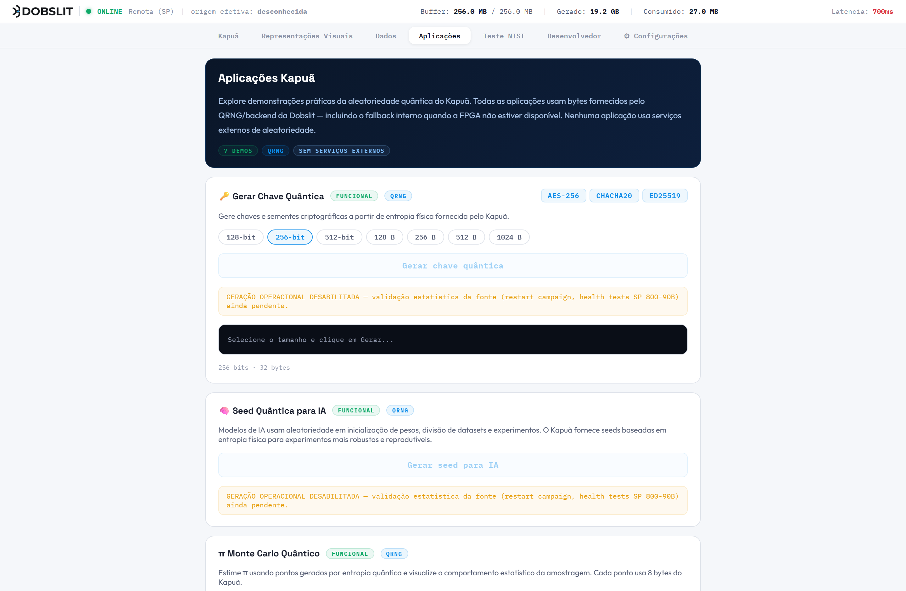
- **Lote assíncrono:** `/v1/bulk-random-jobs*` — stub, responde 501.
- **Captura live no NIST:** `live_capture_configured = false`; sem execuções periódicas.
- **`live_verified = true`:** não ocorre enquanto a FPGA não carimbar `captured_at`.

---

## 29. Limitações conhecidas

1. **Origem física não comprovada.** `provenance = unknown`, `live_verified = false`, `captured_at = null` — intencional. Não trate os dados como "live verificado".
2. **Unidade da amostra física desconhecida.** Não se sabe (sem o RTL) quantos bits do ADC formam a palavra de 32 bits, se há decimação, XOR entre canais ou seleção de bits. O contrato garantido é apenas: 32 bits, little-endian, sem conditioning **no software**.
3. **Condicionamento na FPGA não confirmado.** Evidências indiretas sugerem que **não** há whitening em hardware, mas isso não está provado.
4. **`buffer_health = discontinuous` / `X-QRNG-Discontinuities = 256` em produção.** O broker conta todo *drop-oldest* (backpressure normal) como descontinuidade. Uma correção (contar só realinhamentos e perdas reais) existe em branch, **não implantada**.
5. **RCT/APT não rodam no caminho live.** `entropy_health = not_assessed` sempre.
6. **Restart campaign incompleta.** A validação operacional da fonte (reinicializações controladas) não foi concluída.
7. **Projeto Vivado/RTL ausente.** Só o bitstream compilado está disponível (ver `physical-layer/FPGA_INSPECTION_RESULT.md`; a análise de proveniência detalhada do bitstream está em `physical-layer/FPGA_PROVENANCE.md` na branch `investigate/fpga-vivado-artifacts-20260829`).
8. **Testes estatísticos do navegador** (badges) são heurísticas — não são min-entropia nem SP 800-90B.
9. **Análise Estatística usa `byte/255`** → alcança `1.0`. É intencional e testado; não confundir com o Monte Carlo (`uint32/2³²`, `[0,1)`).
10. **Rotas de proxy abertas.** `/qrng/api/` e `/qrng/api-fpga/` respondem sem token (achado de auditoria; fechar exige mudança de nginx autorizada).
11. **Recomendações de texto/UX não implantadas:** nomes de download `kuapua_qrng_*` → `kapua_qrng_*`; `qrng_<n>.bin` → `kapua_qrng_<n>.bin`; badge "Funcional" nos cards desabilitados; banner de fallback mais visível nas Visualizações Interativas. Ver `docs/USER_GUIDE_EVIDENCE_MATRIX.md` (B1–B4).
12. **Texto da própria interface mais forte que este guia.** A página inicial ainda usa frases como "gerar entropia real", "distribuição uniforme comprovada" e "aleatoriedade fundamentalmente imprevisível", e o gráfico do dispositivo traz a grafia antiga "KUAPOÃ". Este guia adota linguagem mais conservadora (seções 13–14 e 3). **Recomendação:** alinhar os textos da UI ao escopo de alegações comprovadas.

---

## 30. Perguntas frequentes

**O Kapuã é um QRNG "quântico"?**
A fonte é física (ruído digitalizado por uma FPGA). A caracterização que confirmaria a natureza e a qualidade da entropia **está em andamento**. Use os dados como "bytes brutos de uma fonte física, em validação".

**Posso usar os bytes para gerar chaves/senhas/tokens?**
Não como material **operacional** — a geração criptográfica está desabilitada de propósito. Para pesquisa e simulação, sim.

**Os 4 formatos dão dados diferentes?**
Não. `raw`, `hex`, `base64` e `uint8` são a **mesma** sequência de bytes, representada de formas diferentes. (Cada **chamada nova** dá bytes novos — isso sim é esperado.)

**Por que duas chamadas seguidas dão resultados diferentes?**
Porque é uma fonte de aleatoriedade. Para comparar formatos, use **uma** amostra e reserialize localmente.

**O token melhora a qualidade dos dados?**
Não. O token **autentica** e **mede cota**. Os bytes são idênticos com ou sem token.

**"unknown" quer dizer que está quebrado?**
Não. Quer dizer que **não há prova** de que aquela resposta veio do caminho live com captura física. Os bytes fluem normalmente; o que falta é o carimbo de proveniência física.

**O histograma "uniforme" prova que é aleatório?**
Não. É uma inspeção visual. Avaliação séria: página **Teste NIST** — e mesmo ela avalia **a amostra**, não emite um selo permanente.

**Como faço para baixar 10 MB?**
Aba **Dados → Raw Binário** ou **downloads em massa** (`format=raw`). Pela API, faça várias requisições de até 1 MiB.

---

## 31. Glossário

| Termo | Definição |
|---|---|
| **byte** | unidade de 8 bits; a unidade de transporte do Kapuã |
| **uint32-LE** | inteiro de 32 bits sem sinal, lido em little-endian: `b₀ + b₁·2⁸ + b₂·2¹⁶ + b₃·2²⁴` |
| **little-endian / big-endian** | ordem dos bytes ao montar um inteiro; o Kapuã usa little-endian |
| **integridade dos bytes** | os bytes chegam ao cliente exatamente como saíram da fronteira auditada, sem alteração |
| **transformação de formato** | reapresentar os mesmos bytes (hex/base64/uint8) — não muda o conteúdo |
| **distribuição observada** | como os valores de uma amostra se espalham (histograma, scatter) |
| **entropia (Shannon)** | `−Σ p·log₂ p`; mede incerteza média; **não** é o que a norma criptográfica exige |
| **min-entropia (H∞)** | `−log₂(max p)`; a medida conservadora usada pelo SP 800-90B |
| **IID / não-IID** | hipótese de independência e distribuição idêntica dos símbolos; define qual conjunto de estimadores se aplica |
| **condicionamento (conditioning)** | pós-processamento que compacta/uniformiza a entropia (hash, XOR, extractor). No Kapuã: ausente no software; desconhecido na FPGA |
| **aptidão criptográfica** | conjunto de requisitos (SP 800-90B/A/C) para usar a fonte em chaves/seeds/nonces. **Não atendida hoje** |
| **RCT / APT** | Repetition Count Test / Adaptive Proportion Test — testes de saúde contínuos do SP 800-90B |
| **proveniência** | de onde veio *esta resposta* (`live`/`fallback`/`unknown`/…) |
| **fallback** | fonte alternativa quando a principal falha; sempre identificado |
| **pré-coletado** | buffer local de 10 000 bytes de demonstração; proveniência `unknown`; não é medida ao vivo |
| **rejection sampling** | técnica que descarta parte do intervalo para gerar inteiros uniformes **sem viés de módulo** |
| **modulo bias** | distorção de `x % n` quando `n` não divide o intervalo do gerador |
| **PRNG / LCG / MT19937** | geradores pseudoaleatórios determinísticos; no Kapuã aparecem **só** como comparação didática |
| **token pessoal** | credencial `dobslit_qrng_live_<hex>` para uso da API fora do portal |
| **JWT de sessão** | credencial temporária que autentica a interface do portal |

---

## 32. URLs e referências

| Recurso | URL |
|---|---|
| Portal | `https://bongo.dobslit.com` |
| API — base | `https://bongo.dobslit.com/qrng/v1` |
| API — endpoints públicos | `https://bongo.dobslit.com/qrng/v1/public/random` , `…/public/raw` |
| Swagger UI | `https://bongo.dobslit.com/qrng/v1/docs/` |
| ReDoc | `https://bongo.dobslit.com/qrng/v1/redoc` |
| OpenAPI JSON | `https://bongo.dobslit.com/qrng/v1/openapi.json` |
| Serviço NIST | `https://bongo.dobslit.com/qrng/nist/` (health: `…/qrng/nist/health`) |
| Exemplo Python | `docs/examples/kapua_api_example.py` (neste repositório) |
| Notebook Jupyter (introdução) | `docs/examples/kapua_jupyter_example.ipynb` |
| Notebook de análises (χ², monobit, DFT, π, dado, passeio…) | `docs/examples/kapua_qrng_analises.ipynb` |
| Fluxo de dados das visualizações | `docs/VISUALIZATION_DATA_FLOW.md` |
| Matriz de evidências | `docs/USER_GUIDE_EVIDENCE_MATRIX.md` |
| Resultados da aceitação | `docs/_acceptance/ACCEPTANCE_RESULTS.md` |
| Inspeção da FPGA / fonte física | `physical-layer/FPGA_INSPECTION_RESULT.md` , `physical-layer/NOISE_SOURCE_UNIT.md` (proveniência detalhada do bitstream: `physical-layer/FPGA_PROVENANCE.md` na branch `investigate/fpga-vivado-artifacts-20260829`) |
| Normas | NIST SP 800-90B (final + errata), SP 800-90A Rev. 1 (final), SP 800-90C (final, set/2025) |

---

<div align="center">

*Kapuã — Guia do Usuário — revisão 2026-08-29.*
*Este guia descreve o sistema em produção e distingue explicitamente o comportamento atual das funcionalidades futuras.*
*A caracterização física e a validação operacional da fonte continuam em andamento.*

</div>
